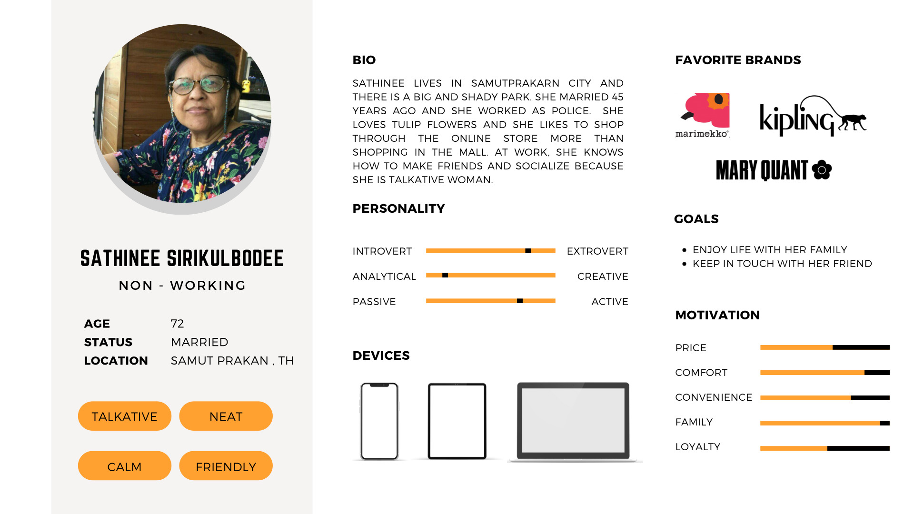
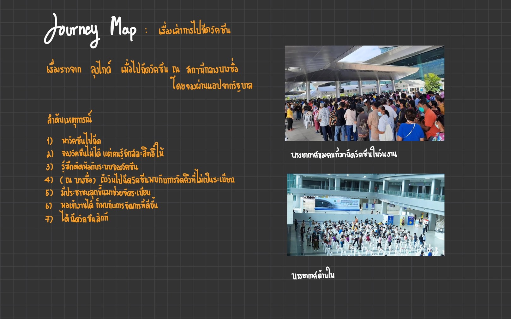
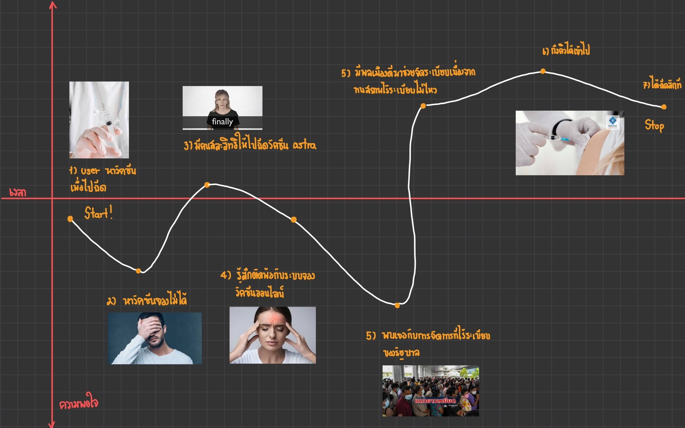
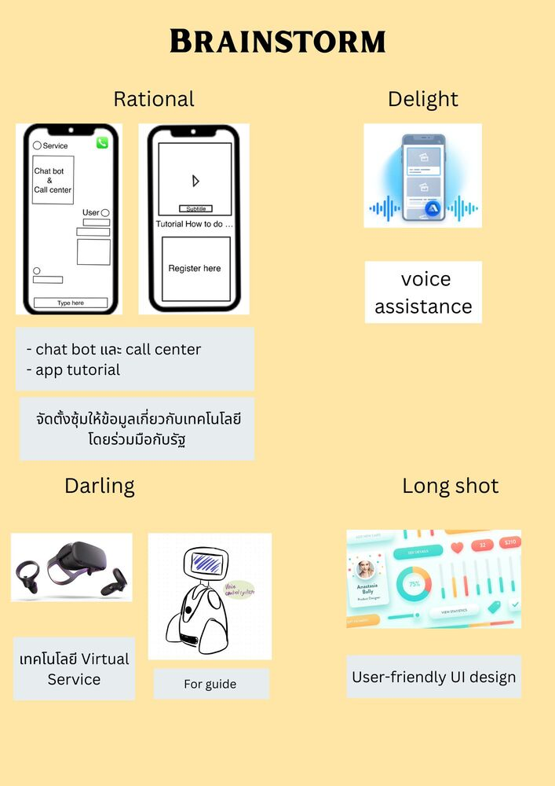
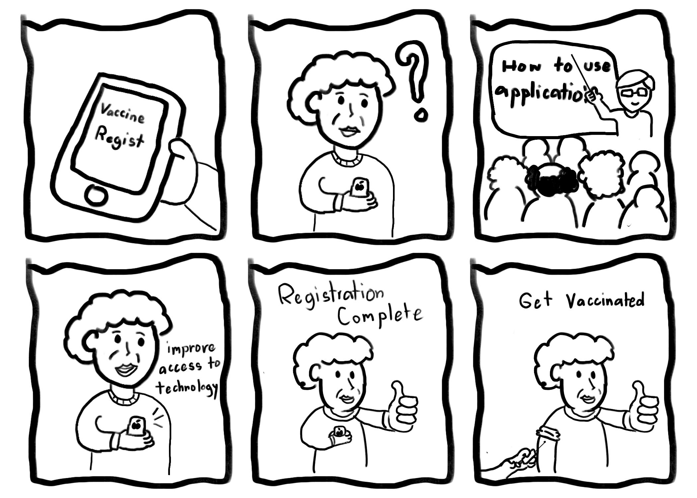

# 💾 Empathize map (Say-Do-Think-Feel) 💻
----------

__จาก Interview ของคุณย่า (การเข้าถึงสวัสดิการจากรัฐ ผ่านเเอปพลิเคชั่นต่างๆ)__ 🎥

_มีสมาร์ทโฟนใช่ไหม แล้วใช้ทำอะไรบ้าง_ 📱

> มี เล่นสื่อต่างๆพวก Facebook Line อะไรแบบเนี่ย YouTube

_แล้วถ้าเป็นเทคโนโลยีในวัยคุณย่าเนี่ยมันมีอะไรบ้างมีอะไรบ้างในตอนนั้น ตอนที่เป็นวัยรุ่น_ 🧒

> ไม่มีเลย โทรศัพท์ก็ไม่มีเลยตอนนั้น แต่จะมียุคนึง ที่เรียก paclink ( คุณย่าหมายถึงpager แต่ผู้ให้บริการชื่อpacklink ) เวลาจะติดต่อใครหรืออะไรก็โทรไป เหมือนโทรไปที่ศูนย์เค้า แล้วเค้าก็จะ บอกคนนั้นต่อให้แล้วคนนั้นก็จะโทรกลับมา 

_แล้วคุณย่าคิดว่า ในชีวิตประจำวัน โทรศัพท์หรือสมาร์ทโฟนเนี่ย มีประโยชน์ต่อคุณย่าไหม เพราะอะไร_ 📲

> มีมากเลย หนึ่งคือเราได้อ่านข่าวสาร ไม่ต้องดูจากหนังสือพิมพ์ เวลามีข่าวก็เปิดดูได้เลย น้ำท่วมที่ไหนอะไรงี้ อีกอย่างก็ได้รู้ เห็นเพื่อนทำอะไรอะไรแบบนี้ลงใน Facebook ติดต่อกันง่าย หรือไม่ก็ถ้าอยากรู้อะไร ก็สามารถเปิด Google ดูได้ ถ้าอยากซื้อของก็ดูได้อยากซื้ออะไรก็สั่ง

_แล้วคุณย่าคิดยังไงกับการที่รัฐบาลให้สิทธิ์กับผู้สูงอายุเช่นคนละครึ่ง_ 💸

> ก็งั้นๆ อะ บางคนก็ไม่ได้สิทธิ์ แล้วก็ใช้ยากถ้าบางคนไม่มี Wi-Fi หรือเน็ตโทรศัพท์ ก็ใช้ไม่ได้
----------

## 💭 WHAT , HOW and WHY 💭

| What ☎️ | How 💌 | Why 📞|
| ------------- | ------------- | ------------- |
| `คุณย่า`ต้องการติดต่อสื่อสารกับคนอื่นและติดตามข่าวสาร | ในสมัยก่อนใช้ pager ในการติดต่อสื่อสารและอ่านแต่หนังสือพิมพ์ | สมัยนั้นไม่มี smartphone มีแต่ pager และ หนังสือพิมพ์ |
| `คุณย่า`ใช้แอปพลิเคชั่นไม่คล่องทำให้ไม่ได้สิทธิ์ที่ควรจะได้รับ | เรียนรู้การใช้สมาร์ทโฟนเเละเทคโนโลยีใหม่ๆเพื่อการเข้าถึงสิทธ์ | เพื่อที่จะได้เข้าถึงสิทธิ์ที่คุณย่าควรได้รับ
----------

## OBSERVED 🌝
### SAY 💬
-  "สมัยก่อนเทคโนโลยียังไม่เเพร่หลายเหมือนปัจจุบัน"
-  "สมาร์ทโฟนมีประโยชน์"
-  "app บางตัวก็ใช้ยาก กดไม่เป็น"
-  "สิทธ์จากรัฐก็งั้นๆ"
### DO ✍️
- ใช้สมาร์ทโฟนในการติดตามข่าวสาร
- เล่นสื่อ social media เช่น Facebook, Line
- ให้ลูกหลานเป็นคนสอนใช้ + ทำให้ (เช่น การโหลดเเอป, สมัครสิทธิต่างๆ)
## INFERRED 🌛
### THINK 💭
- คิดว่าสิทธิจากรัฐบาลเข้าถึงยาก
- คิดว่าถ้าใช้ไม่เป็นอาจจะทำของพังได้
- คิดถึงการติดต่อสื่อสารเเละการอ่านข่าวสารต่างๆ (สมาร์ทโฟน)
### FEEL 🌙
- Over-whelmed
- Fear
- Afraid
- Excited
- Confused
- Disappointed
--------

# User persona

--------
# Define
## Journey Map ⭐
### ลำดับเหตุการณ์ ลุงไกด์ ประสบการณ์การจองวัคซีนผ่านเเอปรัฐบาล

### Journey Map 🌟

----------

## 🤯 Needs & Insights 👀
### Needs
	* ความต้องการที่จะเข้าถึงเทคโนโลยีได้ง่ายขึ้นโดยที่คำนึงถึงว่าเวลามีสถานการณ์ที่ต้องใช้ก็สามารถทำได้ด้วยตนเอง
### Insight
	* โดยปกติแล้วย่าก็มีการใช้เทคโนโลยีเป็นประจำอยู่แล้วแต่พอมีการลงทะเบียนจากทางรัฐบาลบางทีก็ไม่สามารถทำให้ย่าเข้าใจหลักการใช้งานจริงๆได้
----------

## ✨ Point Of View 
*คุณย่าเป็นคนที่มีนิสัยอย่างไร 💜*
> มีโอกาสได้สัมภาษณ์กับคุณย่าที่มีอารมณ์ขัน เป็นคนเฟรนลี่และมีมนุษย์สัมพันธ์ที่ดี
 
*ทำไมคุณย่าถึงไม่กล้าที่จะเริ่มใช้เทคโนโลยี 🟣*
> คุณย่ากลัวทำของพังเนื่องจากเทคโนโลยีพวกนี้ค่อนข้างมีราคาเเละมีเเนวโน้มที่จะเปิดใจเมื่อเขาได้เรียนรู้ว่าเทคโนโลยีพวกนี้ทนทานกว่าที่เห็นมาก
 
*คุณย่าเริ่มที่เปิดใจกับเทคโนโลยีได้อย่างไร 🟪*
> ในสมัยก่อนเทคโนโลยียังไม่ได้เข้าถึงง่ายเหมือนปัจจุบันทำให้ ผสอ. ในยุคนี้ได้เรียนรู้เทคโนโลยีช้ากว่าเเละอาจมองว่าเป็นเรื่องไกลตัว
 
*คุณย่าบอกว่าจะเกิดการเปลี่ยนแปลงที่ดีถ้า 📰*
> แอพพลิเคชั่นใช้ง่ายกว่านี้เพราะคุณย่าเองก็เป็นคนที่ชอบติดตามข่าวสารตลอดเวลา ถ้าได้แอพพลิเคชั่นที่ใช้ง่ายกว่านี้ก็จะติดตามข่าวได้ทุกช่วงเวลา
----------
# Ideate
## Brainstorm 🧠

--------

# Prototype
## ABOUT PROTOTYPE
### - จัดตั้งซุ้มเพื่อให้ข้อมูลเกี่ยวกับการใช้เทคโนโลยีเเก่ผู้บริโภค โดยเล็งไปที่ผู้สูงอายุ
เนื่องจากปัญหานี้ค่อนข้างเป็นเรื่องใหญ่จึงต้องการความช่วยเหลือจากภาครัฐ โดยอาจจ้างคนอบรมจากทางมหาวิทยาลัย ถือเป็นการสร้างงาน สร้างรายได้ให้นักศึกษาบ้าง
### What - จากการสัมภาษณ์เเละเก็บข้อมูล สรุปว่า
1. ผู้สูงอายุบางกลุ่มมีมุมมองเกี่ยวกับเทคโนโลยีว่าเป็นเรื่องไกลตัว สาเหตุอาจมาจะการที่ในยุคสมัยนั้นเทคโนโลยียังไม่เเพร่หลายเท่าปัจจุบัน
2. ผู้สูงอายุบางกลุ่มไม่กล้าใช้เทคโนโลยีบางอย่างเพราะว่ากลัวชำรุดหากใช้งานไม่เป็น จึงมักให้เป็นหน้าที่ลูกหลานเป็นคนจัดการ
3. ผู้สูงอายุบางกลุ่มมีเเนวโน้มจะตกเป็นเป้าหมายของการโดนข่าวปลอม (Fake news) หรือการโดนโกงในโลกอินเตอร์เน็ตได้มากกว่าวัยอื่นๆ
### How - เราจะจัดตั้งซุ้มเพื่อให้ข้อมูลเเก่ผู้สูงอายุ ประกอบไปด้วย
1. การอบรมการใช้ Software 
2. วิธีการสมัครสิทธิพื้นฐานที่ได้จากภาครัฐ (เพื่อให้เขาสามารถเข้าถึงสวัสดิการพื้นฐานได้สะดวกยิ่งขึ้น)
3. ให้ข้อมูลเกี่ยวกับความปลอดภัยในโลกอินเตอร์เน็ตเพื่อป้องกันอันตรายต่างๆเช่น การโดน spam, theif-identity
--------

## Storyboard 🎞️

### Storyboard Explain 📃
1. `User` รู้ว่ามีการลงทะเบียนการฉีดวัคซีนขึ้นแต่รับเพียงจำนวนจำกัดเท่านั้น
2. `User` ไม่เข้าใจถึงวิธีการลงทะเบียน เพราะไม่คุ้นชินกับเทคโนโลยี
3. `User` ได้เข้าร่วมการพัฒนาทักษะการเข้าถึงเทคโนโลยีสำหรับผู้สูงอายุทำให้สามารถเข้าใจ UI ต่างๆของแอปได้ดี
4. `User` มีความเข้าใจในเทคโนโลยีมากขึ้น
5. `User` ลงทะเบียนได้สำเร็จเพราะได้เข้าร่วมการอบรมการใช้เทคโนโลยีสำหรับผู้สูงอายุ
6. `User` ได้รับวัคซีนถูกต้องตามสิทธิ์ที่ผู้สูงอายุควรได้รับ
--------
# Test
## Feedback
--------

## Members' Role
