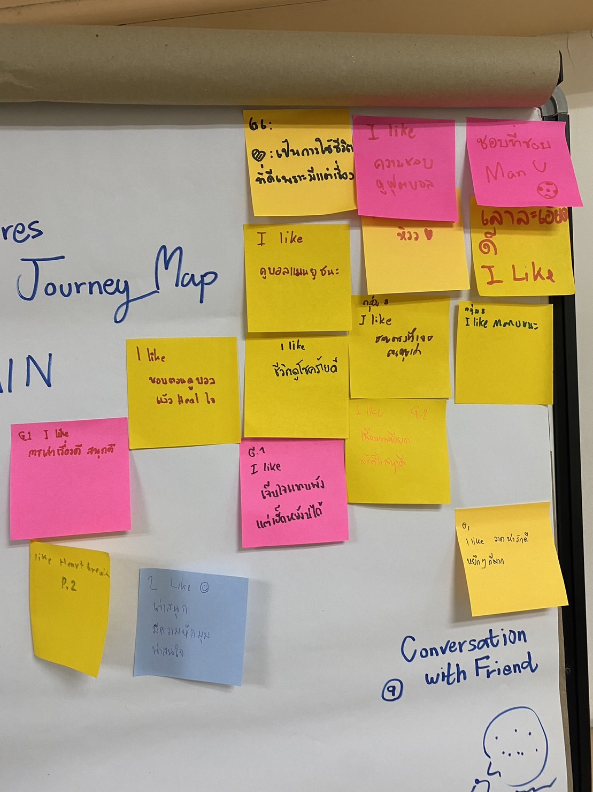

## 💭 WHAT , HOW and WHY 💭

| What 💔 | How 😔 | Why 😭|
| ------------- | ------------- | ------------- |
| `User` อกหักเจ็บปวดรวดร้าว | กินชาบูแก้เซ็ง,ใช้เวลากับเพื่อน | เจอคนคุยเก่าเดินกับคนคุยใหม่ |
| `User` เครียด | ดูบอลคลายเครียด | เศร้าใจทำให้ไม่มีแรงเรียนต่อ |

-------
## Say-Do-Think-Feel 🗣️

### OBSERVED 👀
 * Say 💬
 > `user` ให้สัมภาษณ์ไว้ว่าตอนที่ไปเจอคนคุยเก่าเดินกับคนใหม่ตอนนั้นนี้คือหมดคำพูด
 * Do ✍️
 > `user` เลือกที่จะระบายความเจ็บกับเพื่อนๆ เเละทำอย่างอื่นจะได้ไม่คิดมากกับเรื่องนี้
### INFERRED 🤔
 * Think 💭
 > `user` คงคิดว่าตอนนั้น คงหมดโอกาสที่จะได้เป็นเพื่อนกับคนคุยเก่า
 * Feel ❤️
 > `user` น่าจะรู้สึกเจ็บกับเรื่องนี้ช่วงนึง เเต่สักวันคงผ่านมันไปได้
-------
## Journey Map ☁️

## Onsite Image ⛅

-------
## :smirk: Feedback :kissing_closed_eyes:

* I like :yum:
> _ชอบการเล่าเรื่อง_

> _เนื้อเรื่องน่าสนใจ_

> _วาดรูปสวย_

* I wish :no_mouth:
> _การพูดบางช่วงยังติดขัดอยู่_

> _คนพูดไม่กล้าแสดงออก_
-------
## 🤯 Needs and Insights 👀
Team
* Needs - ความต้องการที่จะจัดการกับความรู้สึกเจ็บปวดของ `User` 😞

* Insight - เเม้ปกติ `User` จะเป็นคนที่ร่าเริงเเละพูดเก่งเเต่เมื่อต้องรับมือกับความซึมเศร้าก็ยังเป็นอุปสรรค 😭 เเละ `User` เป็นคนที่คิดมาก 🧠
-------
## ✨ Point Of View 

>ได้สัมภาษณ์กับuserที่มีลักษณะ _สุขุม เป็นperfectionist_ เข้าสังคมและเข้ากับคนอื่นได้ง่าย 

>จากข้อมูลทำให้แปลกใจเพราะพบว่า จากที่userเป็นperfectionist ดูเป็นผู้ใหญ่ เข้าสังคมแต่ก็ _ยังมีปัญหาที่จัดการตัวเองไม่ได้_

>ซึ่งเข้าใจว่าที่userเป็นแบบนี้อาจเป็นเพราะ อาจมีบางpartของตัวเองที่ไม่สามารถบอกใครได้ หรือเป็นambivertที่มีบางมุมที่อยากอยู่คนเดียว โดดเดี่ยว เลยทำให้มีช่วงที่ไม่รู้จะปรึกษาใคร 

>ถ้าเราหาวิธีที่สามารถทำให้user _ทำให้ตัวเองไม่รู้สึกโดดเดี่ยวได้หรือได้รับคำแนะนำที่ดีและถูกต้องจากผู้เชี่ยวชาญ_ คงสามารถแก้ปัญหาของuserได้

-------
## :innocent: Member's Roles
First
> หลังจากสัมภาษณ์ user เป็นคนนำข้อมูลที่ได้มาเขียน Journey Map

PLUB 💫
> เล่าเรื่อง,ตกแต่งทั้งหมด, WHAT/HOW/WHY , Assign งานให้เพื่อนๆ , issue

BOAT
> นำข้อมูลจาก Interview มา identify เป็น say-do-think-feel
