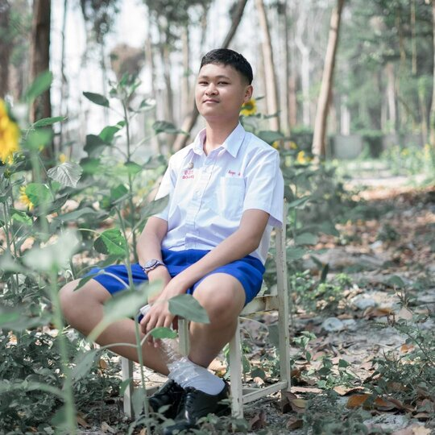
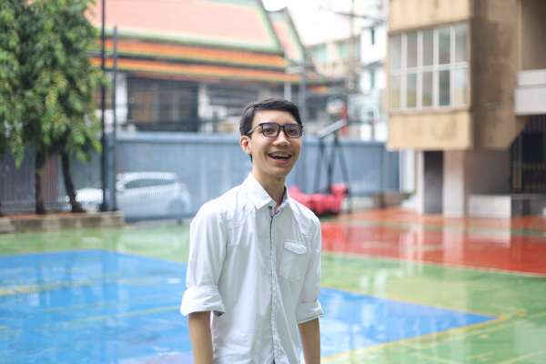
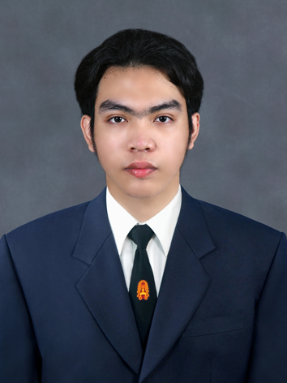
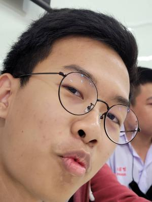

<!-- https://gist.github.com/cuonggt/9b7d08a597b167299f0d วิธีการใช้ markdown syntax  -->
<!-- https://gist.github.com/rxaviers/7360908 ชื่อ Emoji  -->
# WannaBeBillionaires 🤑

## FACTS ABOUT TEAM NAME 💰
 *We thought* :
> *Everyone wants to have money for happiness, and independence. Therefore, we need to be billionaires first. After that, we can do whatever we want with our money and without stress*.
---------
## FACTS ABOUT US ⚡

###  Oct
Interview by Team
>อ๊อกเป็นที่ค่อนข้างเงียบ แต่ถ้าได้รู้จักก็จะเป็นคนที่friendly อ๊อกมาจากโรงเรียนอัสสัมชัญระยอง จังหวัดระยองเป็นโรงเรียนเอกชนที่มีชื่อเสียงในหลายๆจังหวัด เป็นโรงเรียนที่เน้นการเรียนการสอนเป็นภาษาอังกฤษเป็นส่วนใหญ่เพราะเป็นโรงเรียนที่ประวัติยาวนานกับศาสนาคริสต์ และก็เป็นคนที่ตั้งใจทำในสิ่งที่ตัวเองถนัด และเป็นที่ชอบโมเดลมาก สิ่งที่ภูมิใจที่สุดของอ็อกก็คือการที่ได้คะแนนสอบวิชาสังคมเต็ม และความฝันของอ็อกคือการได้ไปทำงานต่างประเทศได้ทำงานที่ชอบและได้เที่ยวในสถานที่ๆอยากจะไปและเหตุผลที่อ็อกเข้ามาเรียนคณะเทคโนโลยีสารสนเทศหรือไอทีก็เพราะว่าอยากที่จะเป็นIT supportให้กับบริษัทของเพื่อนซึ่งมีเพื่อนเป็นเจ้าของบริษัท เหตุผลเพราะอ็อกมีความสนใจในด้านhard ware computerอยู่แล้วก็เลยเลือกอยากที่จะทำอาชีพนี้
* ชื่อ 🍻 : ชิษณุชา เชิงสมอ
* วันเกิด 🍼 : 24/10/2546
* โรงเรียน 🏫 : อัสสัมชัญระยอง
* กิจกรรมที่ชอบ 🏂 : ดูหนัง ฟังเพลง เล่นเกม ดูสารคดี
* จุดเด่น 👍 : ชอบเข้าสังคม
* จุดด้อย 👎 : ไม่กล้าเข้าสังคม
* MBTI ✨ : ISFP
* สายที่สนใจจะเรียน 💬 : IT
* สไตล์การทำงาน 🔋 : ทำจากยากไปง่าย
* อาชีพในอนาคต 💻 : IT support
* ความฝัน 💭 : อยากไปต่างประเทศ
* ไอดอล 💎 : Ryan reynolds
* สเปคที่ชอบ 👩‍❤️‍👨: เป็นคนที่สนใจโลกความเป็นจริง ไม่งอแง
* เพลงที่ชอบ 🎧 : .[uchiagehanabi](https://www.youtube.com/watch?v=-tKVN2mAKRI)
* Contact 📫
  * Facebook : [isakok chengsamo](https://www.facebook.com/profile.php?id=100008276294150)
  * Instagram : [isakok_atp](https://www.instagram.com/isakok_atp/)

### First 
Interview by Poy
>เฟิร์สจบมาจากอัสสัมชัญ ชีวิตวัยมัธยมของเฟิร์ส ช่วงก่อนโควิดโรงเรียนมีการจัดการเเข่งจตุมิตรเเละผมได้มีโอกาสเเปรอักษรต่อหน้าคนนับพันนับว่าเป็นช่วงเวลาที่มีความสุขที่ได้เจอเพื่อนหลากหลายโรงเรียนเเละได้ฝ่าฟันอุปสรรคต่างๆไปพร้อมกับเพื่อนๆ เเต่หลังจากช่วงโควิดก็ค่อนข้างเรื่อยเปื่อย โดยเฉพาะช่วงม.ปลาย ต้องปรับตัวเข้ากับหลายสถานการณ์เเต่เพราะได้มีโอกาสได้ทำงานออกเเบบเว็ปไซต์ให้ชมรมจึงมีความสนใจเกี่ยวกับการเขียนโค้ดเเละคณะ it โดยเฉพาะในเรื่องของ Frontend Developer พอรู้ว่ามหาลัยนี้มีคณะไอทีจึงเลือกยื่นเข้ารอบ portfolio เมื่อได้เรียนคณะ it ก็ยิ่งมั่นใจว่าตัวเองชอบสายนี่จริงๆ เฟิร์สชอบทำงานออกเเบบก่อนที่จะมาเรียนเขียนโค้ด นอกจากนี้ยังชอบทำงานในส่วนของการนำเสนอ ความฝันของเฟิร์สคือการได้ไปทำงานต่อต่างประเทศ

* ชื่อ 🌈 : First
* วันเกิด 🎂 : 24/12/2003
* โรงเรียน 🏫 : อัสสัมชัญ
* กิจกรรมที่ชอบ 🍿: ออกเเบบ ฟังเพลง 
* จุดเด่น 👍 : เขียนโค้ดเร็ว
* จุดด้อย 👎 : โค้ดรันไม่ได้
* สายที่สนใจจะเรียน 🦖 : FrontEnd Backend
* สไตล์การทำงาน 📥 : ทำตอนที่อยากทำ/ใกล้เดดไลน์ ไล่จากง่ายไปยากสุด
* อาชีพในอนาคต 🔮 : UI/UX designer
* ความฝัน 💭 : ทำงาน IT ต่างประเทศ
* เพลงที่ชอบ 🎧 : [OUTTA-MY-MIND](https://music.youtube.com/watch?v=j7CRINnxHAc&list=RDAMPLPLW1dZOqbDTmhroXu2N1Cj00uAKKw7Vnfq)
* Contact 🍭
    * Facebook : [Pattaradanai Srichon](https://www.facebook.com/pattaradanai.srichon)
    * Instagram : [first_ptnd](https://www.instagram.com/first_ptnd/)

###  Boat 🇹🇭
Interview by Plub
>ก่อนจะมาที่ KMUTT โบ๊ทเรียนจบมาจากโรงเรียนบางปะกอกวิทยาคม วันเกิดคือ 13 มกราคม 2547 สิ่งที่ภูมิใจในชีวิตของโบ๊ทก็คือเรื่องที่โบ๊ทนั้นสามารถเริ่มหาเงินเองได้แล้วจากการทำงานและศึกษาเรื่องการ trade ซึงช่วงแรกนั้นท้อมากเพราะไม่สามารถทำกำไรได้เลยแต่ที่โบ๊ทสามารถรอดมาถึงวันนี้เพราะความพยายามแล้วความมุ่งมั่นในเป้าหมายที่ชัดเจนจนถึงตอนนี้ก็รู้สึกว่าที่พยายามไม่เคยเสียเปล่าเลย และที่โบ๊ทที่ได้เลือกที่จะมาเรียนที่คณะ SIT สาขา IT เพราะว่าสนใจที่จะเรียนไปในด้าน Front-end ซึ่งนี้โบ๊ทเองก็คิดว่าตอบโจทย์มาก เพราะว่าอนาคตอยากจะประกอบอาชีพ Front-end developer สไตล์งานที่ชอบคืองานที่จัดสรรระเบียบ เพราะว่าส่วนตัวแล้วเป็นคนที่จะ focus สิ่งที่ทำได้ดีแต่จะ
หมกหมุ่นมากไปเลยต้องแบ่งงานเป็นส่วนๆเพื่อที่จะได้มีเวลาพัก ส่วนตัวโบ๊ทนั้นเองก็ชอบวิชา webtech เพราะได้เรียนตรงกับสายที่สนใจจะเรียน ความฝันคือที่คิดไวเลยคือการหาเงินมากๆอย่าง Changpeng Zhao ถ้าเป็นสิ่งที่โบ๊ททำในช่วงวันหยุดส่วนใหญ่ก็คงมีแค่เล่นเกมกับฟังเพลง

* ชื่อ 🍻 : ติณณภพ เทียนบาง
* วันเกิด 🍼 : 13/01/2004
* โรงเรียน 🏫 :บางปะกอกวิทยาคม
* กิจกรรมที่ชอบ 🏂 : เล่นเกม,ฟังเพลง
* จุดเด่น 👍 : focus สิ่งที่กำลังทำได้ดี
* จุดด้อย 👎 : หมกหมุ่นมากเกินไป
* MBTI ✨ : INFJ
* สายที่สนใจจะเรียน 💬 : Front-end
* สไตล์การทำงาน 🔋 : แบ่งงานออกเป็นส่วนๆแล้วทำ checklist
* อาชีพในอนาคต 💻 : Front-end developer
* ความฝัน 💭 : รวย
* ไอดอล 💎 : Changpeng Zhao
* สเปคที่ชอบ 👩‍❤️‍👨: none
* เพลงที่ชอบ 🎧 : [Lovelorn]([https://www.youtube.com/watch?v=vGJTaP6anOU&ab_channel=ElvisPresleyVEVO](https://www.youtube.com/watch?v=UcWkOSyYWNc))
* Contact 📫
  * Facebook : [ติณณภพ เทียนบาง](https://www.facebook.com/profile.php?id=100025362337428)
  * Instagram : [tinnapoptienbang](https://www.instagram.com/tinnapoptienbang/?hl=en)

### POY
Interview by First
>พลอยเป็นคนร่าเริงและค่อนข้าง friendly พลอยมาจากโรงเรียนราชินีบูรณะจังหวัดนครปฐมซึ่งเป็นโรงเรียนหญิงล้วนอันดับหนึ่งของจังหวัด (เพราะเป็นที่เดียวฝนจังหวัด) เป็นโรงเรียนที่ค่อนข้างเน้นกิจกรรมอยู่พอสมควรเพราะว่าอาจารย์ค่อนข้างให้ความสำคัญกับกิจกรรมมากๆ เหตุผลที่พลอยเลือกที่จะเข้าคณะไอทีเพราะในอนาคตเธออยากจะทำงานในสายนี้ โดยเฉพาะในสายอาชีพของ UX/UI Design เธอคิดว่าในอนาคตบริษัทต่างๆจะต้องการคนที่มีความสามารถในสายอาชีพนี้มากขึ้น ชีวิตในมหาลัยของพลอยค่อนข้างปกติดีในตอนนี้

* ชื่อ 🌈 : นางสาวณัฐวรรณ คุ้มเผ่า
* วันเกิด 🎂 : 03/05/2004
* โรงเรียน 🏫 : ราชินีบูรณะ
* กิจกรรมที่ชอบ 🍿: ดูnetflix ฟังเพลง hangout
* จุดเด่น 👍 : perfectionist ชอบเรียนรู้อะไรใหม่ๆ
* จุดด้อย 👎 : หมดpassionง่าย 
* MBTI 🍭 : ISFP-T
* สายที่สนใจจะเรียน 🦖 : Website
* สไตล์การทำงาน 📥 : ทำตอนที่อยากทำ/ใกล้เดดไลน์ ไล่จากง่ายไปยากสุด
* อาชีพในอนาคต 🔮 : Web-dev , Creative web designer
* ความฝัน 💭 : มีเงินโดยไม่ต้องทำงาน
* ไอดอล ✨: ไม่มี
* สเปคที่ชอบ 👩‍❤️‍👨: extrovert ความคิดโตกว่า ฉลาด
* เพลงที่ชอบ 🎧 : [Show me how](https://youtu.be/OZRYzH0Q0pU)
* Contact 🍭
    * Facebook : [Poy nattawan](https://www.facebook.com/profile.php?id=100011569219058)
    * Instagram : [boredbearx](https://instagram.com/boredbearx?igshid=YmMyMTA2M2Y=)

### PLUB
* ชื่อ 🚤  :  จิรพัส จันทร์พงษ์
* วันเกิด 🍼  : 04/03/2547
* โรงเรียน 🏫  : เทพศิรินทร์
* กิจกรรมที่ชอบ 🔈  : ขี่เจ็ทสกี ว่ายนำ้ ฟังเพลง เล่นเกม ดูหนัง
* จุดเด่น 👍 : ขยัน ตั้งจำจนถึงที่สุด
* จุดด้อย 👎 : ขี้เกียจ โดนdistractง่าย
* MBTI ✨ : INFJ or INFP
* สายที่สนใจจะเรียน 💬   : Database
* สไตล์การทำงาน 🔋 : ทำให้เสร็จเร็วที่สุด
* งานในอนาคต 💻 : Data Science
* ความฝัน 💭 : เที่ยวรอบโลก , เป็น Billionaire
* ไอดอล 💎 : Elon Musk
* สเปคที่ชอบ 👩‍❤️‍👨 :  be kind with me , don't lie 
* เพลงที่ชอบ 🎧 : [Can't help falling in love](https://www.youtube.com/watch?v=vGJTaP6anOU&ab_channel=ElvisPresleyVEVO)
* Contact 📫
  * Facebook : [Jiraplus](https://web.facebook.com/jiraplus.chanpong/)
  * Instragram : [idontcareanyfxxkthing](https://www.instagram.com/idontcareanyfxxkingthing/)

 ### TEAM
* ชื่อ👋:  ทัศน์พล เถื่อนชำนาญ
* วันเกิด👶🏼: 23/11/2546
* โรงเรียน🏫 : อัสสัมชัญสมุทรปราการ
* กิจกรรมที่ชอบ🎮: ฟังเพลง เล่นเกม ดูหนัง
* จุดเด่น👍: รับผิดชอบในงานของตนเอง
* จุดด้อย👎: ไม่ค่อยกล้าเเสดงออก
* MBTI🌈: ISFJ-T
* สายที่สนใจจะเรียน💻 : Programming
* สไตล์การทำงาน✅: วางเเผนก่อนทำงาน
* ความฝัน💸: รวย ทำในสิ่งที่อยากทำ
* เพลงที่ชอบ 🎧 : [Never gonna give you up](https://www.youtube.com/watch?v=dQw4w9WgXcQ)
* Contact 📫
  * Facebook : [Teammy Taspol](https://www.facebook.com/profile.php?id=100011744889849)
  * Instagram : [teammy_21](https://www.instagram.com/teammy_21/)

